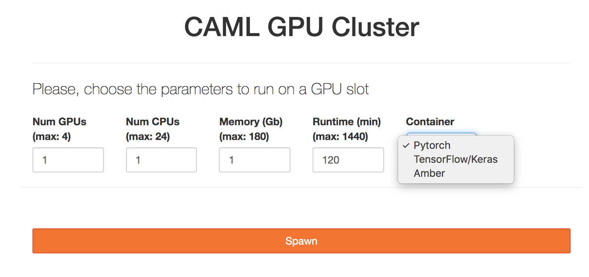

# CAML

This page contains information regarding the NSF funded Cyberinfrastructure to Accelerate Machine Learning (CAML) computing resource. CAML provides GPU resources for accelerating machine learning to the research community both locally at the University of Notre Dame and nationally through the Open Science Grid (OSG).

CAML physically hosts GPU resources suitable for accelerating the training of models from standard Deep Learning libraries. Configured for both interactive and batch access, CAML supports both small-scale explorations to large-scale discovery science.

## Access requirements

In order for local users to access this resource, a CRC account and access to the Panasas (scratch) storage. Please, follow the links below for more information on how to obtain these:

- Obtaining a CRC account: <https://docs.crc.nd.edu/new_user/obtain_account.html>
- Panasas storage: <https://docs.crc.nd.edu/infrastructure/storage.html?highlight=scratch365#panasas-scratch-storage>

Access through OSG can be done by signing up to OSG Connect: <https://www.osgconnect.net> Note only 20% of resources are allocated via this method at this point.

## Resource description

The CAML GPU cluster is composed of:

**camlnd.crc.nd.edu (frontend / submit host)**

``` shell
- 17 Dual 12-cores Intel(R) Xeon(R) Gold 6226 CPU @ 2.70GHz, 192 GB of Memory, 400 GB Disk
  4 GPUs NVIDIA Quadro RTX 6000

- 2 Dual 12-cores  Intel(R) Xeon(R) Gold 6226 CPU @ 2.70GHz, 192 GB of Memory, 400 GB Disk
  4 GPUs NVIDIA Tesla V100-PCIE-32GB
```

------------------------------------------------------------------------

## Using the resource on campus

The university provides two different methods to access this resource: through a Jupyterhub service and via HTCondor.

The former allows users to start interactive [Jupyterhub](https://jupyterhub.readthedocs.io/en/stable/) notebook sessions on CAML GPU resources. The latter (HTCondor) is a batch system that provides a job queueing mechanism, allowing the scheduling of multiple jobs to this resource in parallel.

------------------------------------------------------------------------

## Jupyterhub service

Use this method if you need to access a single GPU resource interactively, through notebook sessions from your browser.

### Pre-requisites

From a remote location (e.g. off campus, etc.), one must *first* log into the VPN. More information is available in the section `off-campus-connect`.

### Instructions

After you get an account in camlnd.crc.nd.edu, you can click on the URL below in order to user Jupyterhub with CAML resources. This will start jupyter notebooks inside the GPU nodes for a specific amount of time. At present, access to your AFS Home area is allowed in read-only mode, use /scratch365/\$USER to write files.

<https://camlnd.crc.nd.edu:9800/>

1.  Use your campus credentials to log in.


2.  Then, set the following parameters (note more demanding parameters may take longer to be scheduled, so please try to estimate the resources and time needed for your work as best as possible):

> - GPUs: Number of GPUs for your application, up to 4. Default: 1
> - CPUs: Number of CPUs. Default: 1
> - Memory: Requested Memory (GB)
> - Runtime: Maximum wall clock time (in minutes) allowed for your notebook to run. Max: 24 hours, Default:2 hours.
> - Container: This will be the software environment needed for your application. Please, ask the CRC for help if you need an environment not listed here.



3.  Finally, you can either run python notebooks or work directly in the terminal. You can try the pytorch notebook example with the pytorch container. Note your starting directory will be located on /scratch365/\$USER.


Please, refer to the [jupyter-notebook documentation](https://jupyter-notebook.readthedocs.io/en/stable/examples/Notebook/Notebook%20Basics.html) for more information.

------------------------------------------------------------------------

## HTCondor Submission

In order to use CAML resources, we require defining singularity images on PATHs. E.g.: Via cvmfs.

For example, the following Notre Dame image (available via CVMFS) supports TensorFlow, Keras and PyTorch:

``` shell
/cvmfs/singularity.opensciencegrid.org/notredamedulac/el7-tensorflow-pytorch:latest
```

and it is built from: <https://github.com/NDCMS/el7-tensorflow-gpu>

This section will show submission examples for different workflows, pointing to the specific Singularity images to handle the software environment dependencies.

### HTCondor submission file

HTCondor needs a submission file, describing the resources needed, input files, log paths, container image location and executable to run. E.g.:

``` shell
executable = yourexecutable.sh

# Note if you use a subdirectory like logs, you need to create it beforehand
# E.g.: mkdir logs
Log    = logs/$(Cluster).log
Output = logs/$(Cluster)-$(Process).out
Error  = logs/$(Cluster)-$(Process).err

# Input files
# You can transfer files like this:
should_transfer_files = Yes
transfer_input_files = /some/path/input_file

# But if you are using /scratch365 and all your input files are present there, all worker nodes will have read/write access to it, so you can just use the scratch365 paths instead without transferring the input files and set the following instead:
should_transfer_files = IF_NEEDED

# Singularity image, for amber for example, it would be:
#+SingularityImage = "cvmfs/singularity.opensciencegrid.org/notredamedulac/amber:latest"

# Number of GPUs, Cpus and Memory to use
request_gpus   = 1
request_memory = 1 Gb
request_cpus   = 1

# Number of jobs to submit
Queue 1
```

Please, refer to the [HTCondor documentation](https://docs.crc.nd.edu/resources/condor.html) for more details on how to create a submission file.

### Setting up the tutorial examples

Once you log in into camlnd.crc.nd.edu, type:

``` shell
cd /scratch365/$USER
git clone https://github.com/ND-CRC/ndgputests
cd ndgputests
```

Then, follow one of the examples below.

#### Tensorflow example

``` shell
$ condor_submit submit_tensorflow.jdl
```

Output example:

``` shell
- Executing python TensorFlow matrix multiplication example
  2020-03-25 13:18:29.845113: I tensorflow/core/platform/cpu_feature_guard.cc:141] Your CPU supports instructions that this TensorFlow binary was not compil    ed to use: AVX2 AVX512F FMA
  2020-03-25 13:18:30.004982: I tensorflow/core/common_runtime/gpu/gpu_device.cc:1432] Found device 0 with properties:
  name: Quadro RTX 6000 major: 7 minor: 5 memoryClockRate(GHz): 1.62
  pciBusID: 0000:2f:00.0
  totalMemory: 22.17GiB freeMemory: 22.00GiB
  2020-03-25 13:18:30.005161: I tensorflow/core/common_runtime/gpu/gpu_device.cc:1511] Adding visible gpu devices: 0
  2020-03-25 13:18:30.570670: I tensorflow/core/common_runtime/gpu/gpu_device.cc:982] Device interconnect StreamExecutor with strength 1 edge matrix:
  2020-03-25 13:18:30.570757: I tensorflow/core/common_runtime/gpu/gpu_device.cc:988]      0
  2020-03-25 13:18:30.570794: I tensorflow/core/common_runtime/gpu/gpu_device.cc:1001] 0:   N
  2020-03-25 13:18:30.570954: I tensorflow/core/common_runtime/gpu/gpu_device.cc:1115] Created TensorFlow device (/job:localhost/replica:0/task:0/device:GPU    :0 with 21320 MB memory) -> physical GPU (device: 0, name: Quadro RTX 6000, pci bus id: 0000:2f:00.0, compute capability: 7.5)
  result of matrix multiplication
  ===============================
  [[ 1.0000000e+00  0.0000000e+00]
   [-4.7683716e-07  1.0000002e+00]]
  ===============================
```

#### Pytorch example

``` shell
$ condor_submit submit_pytorch.jdl
```

Output example:

``` shell
- Executing python torch matrix multiplication example
--- Debug information ---
- torch version: 1.4.0
- GPU information:
-- CUDA Available: True
-- Number of devices: 1
-- CUDA Device Name: Quadro RTX 6000
-- Current CUDA device: 0
------
result of matrix multiplication
===============================
tensor([[ 1.0000e+00,  0.0000e+00],
        [-4.7684e-07,  1.0000e+00]], device='cuda:0')
```

#### Amber example

``` shell
$ condor_submit submit_amber.jdl
```

Output example:

``` shell
- Entering scratch365 submit directory
- Executing pmemd.cuda
- Amber job is completed.
- Exit code: 0

# From mdout
|------------------- GPU DEVICE INFO --------------------
|
|            CUDA_VISIBLE_DEVICES: 0
|   CUDA Capable Devices Detected:      1
|           CUDA Device ID in use:      0
|                CUDA Device Name: Quadro RTX 6000
|     CUDA Device Global Mem Size:  22698 MB
| CUDA Device Num Multiprocessors:     72
|           CUDA Device Core Freq:   1.62 GHz
|
|--------------------------------------------------------
```

#### JAX example:

``` shell
$ condor_submit submit_jax.jdl
```

Output example:

``` shell
- Executing python JAX matrix multiplication example
-----GPU devices information-----
[GpuDevice(id=0)]
GPU host id: 0
---------------------------------
Generate a random matrix
[[ 1.3890220e+00 -3.2292119e-01  1.5543443e-01 ...  1.6672333e-01
   1.0217550e+00  9.6981764e-02]
 [ 1.0637628e+00 -1.8089763e+00 -7.7909984e-02 ...  1.1778636e+00
  -4.3357372e-01 -2.7877533e-01]
 [-4.4029754e-01 -3.2537547e-01  2.7817255e-01 ...  6.8317270e-01
  -6.1108190e-01 -6.3071573e-01]
 ...
 [ 2.9218230e-01 -4.0055802e-01 -1.4978158e+00 ...  3.0673659e+00
  -1.1350130e+00  4.0964666e-01]
 [ 2.7635786e-01  1.5621810e-01  2.2997444e-03 ...  6.8930797e-02
  -4.0692501e-02  4.1683877e-01]
 [ 1.0231308e+00 -2.7423611e-01 -8.0369931e-01 ...  1.9415886e+00
   1.0946993e+00  2.1876085e+00]]
Multiply by its transpose:
result of matrix multiplication
=================================
[[2938.1716     17.38843    36.508224 ...   32.315964   51.31904
   -34.432022]
 [  17.38843  3031.179      41.194584 ...   47.24877    58.077858
   -13.371615]
 [  36.508224   41.194584 3000.4697   ...    8.109009  -42.50184
    26.49511 ]
 ...
 [  32.315964   47.24877     8.109009 ... 2916.339      34.381073
    39.404526]
 [  51.31904    58.077858  -42.50184  ...   34.381073 3032.2844
    63.69183 ]
 [ -34.432022  -13.371615   26.49511  ...   39.404526   63.69183
  3033.4866  ]] ] ] ] ] ]] ] ] ] ] ]]
```

------------------------------------------------------------------------

#### DeepSphere example

``` shell
$ condor_submit submit_deepsphere.jdl
```

Part of output example:

``` shell
emory) -> physical GPU (device: 0, name: Quadro RTX 6000, pci bus id: 0000:2f:00.0, compute capability: 7.5)
2020-05-18 14:09:22.115326: I tensorflow/core/common_runtime/gpu/gpu_device.cc:1639] Found device 0 with properties:
name: Quadro RTX 6000 major: 7 minor: 5 memoryClockRate(GHz): 1.62
pciBusID: 0000:2f:00.0
step 75 / 112 (epoch 8.00 / 12):
  learning_rate = 1.00e-01, training loss = 3.12e-03
  validation accuracy: 100.00 (50 / 50), f1 (weighted): 100.00, loss: 1.38e+00
  CPU time: 10s, wall time: 11s
step 90 / 112 (epoch 9.60 / 12):
  learning_rate = 1.00e-01, training loss = 5.68e-03
  validation accuracy: 100.00 (50 / 50), f1 (weighted): 100.00, loss: 1.41e+00
  CPU time: 11s, wall time: 12s
step 105 / 112 (epoch 11.20 / 12):
  learning_rate = 1.00e-01, training loss = 2.04e-03
  validation accuracy: 100.00 (50 / 50), f1 (weighted): 100.00, loss: 1.44e+00
  CPU time: 12s, wall time: 13s
step 112 / 112 (epoch 11.95 / 12):
  learning_rate = 1.00e-01, training loss = 1.00e-03
  validation accuracy: 100.00 (50 / 50), f1 (weighted): 100.00, loss: 1.44e+00
  CPU time: 13s, wall time: 14s
validation accuracy: best = 100.00, mean = 100.00
```
