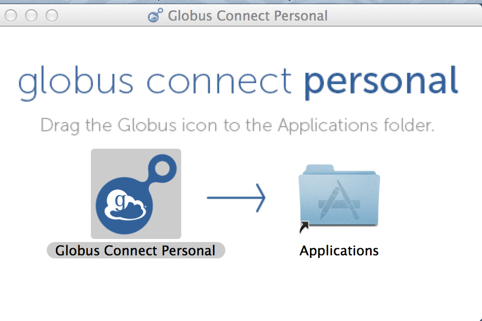

# Globus

## What Is Globus?

Globus allows researchers everywhere to have access to a fast, powerful file transfer service that’s easy to use. Simply submit a transfer request and walk away — no need to babysit your job or worry about coming back to a failed request. Globus manages file transfers for you: monitoring performance, retrying failures, auto-tuning, recovering from faults automatically when possible, and reporting status. Globus also allows you to quickly and efficiently share data with collaborators around the globe even if they are not a part of ND.

------------------------------------------------------------------------

## Setting Up Globus at the CRC

For instructions on setting up Globus at the CRC, view our `setting_up_globus` page.

------------------------------------------------------------------------

## Transferring Files to/from CRC

> [!NOTE]
> The instructions below are for transferring files between your personal computer and the CRC systems. If you want to transfer files from the CRC systems to someone without a ND/CRC account (i.e. at another university), please see the `Sharing Files <sharing-files>` section below.

After **Globus Connect Personal** has been installed on your system, you will be able to transfer files through the Globus web interface. Login to Globus if you have not already. Once logged in, you should be on the **Transfer Files** interface. If you are not, you can click "File Manager" towards the top left. Example below:

------------------------------------------------------------------------

### Prepare Endpoints/Collections

Click on the **Collection** field where it says "Start here..." This will bring up a menu from which you can choose recent collections, bookmarks, and collections you have created. To transfer files from your own computer, select the "Your Collections" tab. Here you will see the collection(s) you have created.

- Select the collection you created while setting up Globus Connect Personal. **\*Make sure the Globus Connect Personal program is currently running on your system, otherwise there will be an error.**\*
- Navigate to the other **Collection** field. Here you will enter the name of the CRC's Collection: **ND Center for Research Computing Collection**. If it is your first time connecting to the Collection (or it's been a while), you may be required to authenticate with your ND credentials. If so, click Continue and you will be sent to a page to select your institution. Search for University of Notre Dame and then click Continue and you will log in through Okta. Then select Allow on the next page.
- Once successfully connected to the CRC Collection, it will default to showing the contents of your /scratch365/\<user\>/ directory (you must have /scratch365 space to use Globus at the CRC). This is where transferred files will be stored on the CRC collection.

------------------------------------------------------------------------

### Select and Transfer File(s)

Both Endpoint windows display the files that are in the current path specified in the **Path** field. In order to transfer a file, navigate to the directory where you want to transfer your file to, then on the other Endpoint navigate to the directory of the file you want to transfer.

- Select the file by clicking on it, and click on the corresponding **Start** at the bottom of the Endpoint to transfer the file to the indicated Endpoint. If you want to check on the status of any transfers, click the "Activity" tab on the left Menu.

You will be given a notification if your transfer was submitted successfully. You will then receive an e-mail once the transfer is complete, which will indicate whether the transfer was successful or not.

> [!WARNING]
> At this time, Globus has no intention of supporting AFS authentication. So, in order to transfer files using Globus at the CRC, you are REQUIRED to have /scratch365 space allocated to you at the CRC. To request a /scratch365 space, please e-mail <CRCSupport@nd.edu>. If you need the files in your AFS directory, you can move them to your AFS space after the files have been transferred to your /scratch365 directory.\*\*

------------------------------------------------------------------------

### Sharing Files

With GlobusPlus, users can now share large datasets (or large files) with anyone at any institution or who has a free Globus account (even if they don't have a ND/CRC account). In order to share files with Globus users at other universities and institutions, you need to set up a new shared endpoint. If you haven't already, make sure you set up your own Globus Account as described above. Please note that this also requires having /scratch365 space. If you do not have /scratch365 space yet, please e-mail <CRCSupport@nd.edu> with your request.

------------------------------------------------------------------------

### Quick Guide

1.  Authenticate with Globus and select the CRC endpoint in the Collections Field.

    > - Click "Start Here..."
    > - Type **ND Center for Research Computing Collection** and select the CRC in the drop-down menu.
    > - Authenticate with Okta if necessary.

2.  Navigate to the directory you'd like to share within your /scratch365 space. Highlight it with the mouse.

    > - Click "Share" towards the right of the collection viewer.
    > - Enter a display name, this is what the collaborator will see as the title of the collection.
    > - If desired, enter a description. This is not required.
    > - Click Next to setup Permissions.

3.  Setup permissions to those who'd you like to share to.

    > - Towards the top right, click "Add Permissions - Share With"
    > - You can customize the sharing path if you'd like, or leave it as "/".
    > - Enter the email address of who you'd like to share with. Click **ADD** directly to the right of the email field.
    > - Fill out the rest of the fields if desired.
    > - Click **Add Permission** on the bottom once finished. If the box titled "Send Email" is checked, the collaborator will receive an email from Globus with a link to get to the shared directory.
    > - From here, the collaborator can either download the data using the Connect Personal, or to another endpoint (another university etc).

Globus has a more detailed guide [here](https://docs.globus.org/how-to/share-files/).
